# PORTFOLIO INVESTING USING AN ENSEMBLE OF DATA SCIENCE TECHNIQUES - UNSUPERVISED MACHINE LEARNING AND LONG SHORT TERM MEMORY (LSTM) DEEP LEARNING TECHNIQUES
- a project by Jeffrey Sim

<h1>Table of Contents</h1>

<ul class="toc-item"><li><a href="#NAVIGATING-PROJECT-FILES-AND-FOLDERS" data-toc-modified-id="NAVIGATING-PROJECT-FILES-AND-FOLDERS-1">1&nbsp;&nbsp;NAVIGATING PROJECT FILES AND FOLDERS</a></li><li><a href="#INTRODUCTION" data-toc-modified-id="INTRODUCTION-2">2&nbsp;&nbsp;INTRODUCTION</a></li><li><a href="#PROBLEM-STATEMENT" data-toc-modified-id="PROBLEM-STATEMENT-3">3&nbsp;&nbsp;PROBLEM STATEMENT</a></li><li><a href="#EXECUTIVE-SUMMARY" data-toc-modified-id="EXECUTIVE-SUMMARY-4">4&nbsp;&nbsp;EXECUTIVE SUMMARY</a></li><li><a href="#DATA-DICTIONARY" data-toc-modified-id="DATA-DICTIONARY-5">5&nbsp;&nbsp;DATA DICTIONARY</a></li><li><a href="#DATA-COLLECTION" data-toc-modified-id="DATA-COLLECTION-6">6&nbsp;&nbsp;DATA COLLECTION</a></li><li><a href="#EXPLORATORY-DATA-ANALYSIS-(EDA)" data-toc-modified-id="EXPLORATORY-DATA-ANALYSIS-(EDA)-7">7&nbsp;&nbsp;EXPLORATORY DATA ANALYSIS (EDA)</a></li><li><a href="#PRE-PROCESSING" data-toc-modified-id="PRE-PROCESSING-8">8&nbsp;&nbsp;PRE-PROCESSING</a></li><li><a href="#BASELINE" data-toc-modified-id="BASELINE-9">9&nbsp;&nbsp;BASELINE</a></li><li><a href="#MODELING,-TUNING-AND-EVALUATION" data-toc-modified-id="MODELING,-TUNING-AND-EVALUATION-10">10&nbsp;&nbsp;MODELING, TUNING AND EVALUATION</a></li><li><a href="#TRADING-STRATEGY-AND-TRADING-ROBOT" data-toc-modified-id="TRADING-STRATEGY-AND-TRADING-ROBOT-11">11&nbsp;&nbsp;TRADING STRATEGY AND TRADING ROBOT</a></li><li><a href="#CONCLUSION-AND-RECOMMENDATION" data-toc-modified-id="CONCLUSION-AND-RECOMMENDATION-12">12&nbsp;&nbsp;CONCLUSION AND RECOMMENDATION</a></li></ul>

## NAVIGATING PROJECT FILES AND FOLDERS

**There are five main notebooks:**
1. [00_capstone_README.ipynb](00_capstone_README.ipynb)
-  This file that summarize the entire project and we recommend reading through this file first to get an overall idea of the project.

2. [01_Data_Collection.ipynb](01_Data_Collection.ipynb)
-  This file explain the entire data collection process including sentimental analysis

3. [02_Modeling_Execution_without_Tuning.ipynb](02_Modeling_Execution_without_Tuning.ipynb)
-  This file explain the LSTM modeling process using a generic un-tune model. It also explain in detail the Trading Strategy we used to backtest our models.

4. [03_Modeling_Execution_with_Tuning.ipynb](03_Modeling_Execution_with_Tuning.ipynb)
-  This file is a near exact replica of "02_Modeling_Execution_without_Tuning.ipynb". The key difference are highlighted in green and is center around the model tuning part where Tensorflow Keras Tuner was used.

5. [04_Portfolio_Analysis.ipynb](04_Portfolio_Analysis.ipynb)  -  This file analyzed all the portfolios performance and comparing it against the baseline un-tune portfolio. It summarized and concluded all the findings and ended with various recommendations to improve this project.

**Various folders:**
The main folders are datasets, images, keras_tuner_logs, results and saved_models. All containing inputs and outputs necessary for this project.

## INTRODUCTION

Every crisis brings opportunities and this is no lesser in the world of investing. In recent years, not long after the US-China trade wars put a dent in the world economy. The world slipped further into an economic depression after COVID-19 hit the streets. The stock market corrected sharply and quickly leaving many investors burnt and lost. However, we see this as a once in a decade opportunity to start investing and doing so smartly.

We are a group of Data Scientist in a startup investment advisory firm call "random 42" and we are on a mission to make investing as easy and as accessible to everyone.

Traditional picks of companies to invest into was done by financial professionals analyzing company performance, market trends, economic data, etc. However, for the man on the street it is usually an un-educated pick or just follow someone else choices. There is a common saying of "by the time you hear it, it is too late". This time-consuming process of picking companies deprive investors of making timely trading decisions. With most choosing to leave their money in the bank. Even with emergence of RoboAdvisors, investors are limited to investing into their pre-selected portfolios of companies or index.

To be a successful investor, one must be able to take emotions out of any trade decisions. This is very hard to do even for a veteran investor, even harder when the choice of companies is decided by a human. With the evolution of data science techniques, we will attempt to remove this human decision deficiency.

We will use an ensemble of various data science techniques in our solution to massively collect important performance data, news and analyst opinions. We will use unsupervised machine learning techniques to help investors create portfolio of stocks that are diversified in any market. Thus, reducing the time consuming and often bias process of analyzing and choosing companies to invest into. We will use deep machine learning techniques to predict future price movement and we will back test our solution to prove that it works.

## PROBLEM STATEMENT

The **problems** that we want to solve with this project are:

1. Too time consuming to collect and analyze information to build a viable portfolio.
2. Not having a reliable and repeatable way to predict stock price movement.
3. Not having an automated trading strategy that wins consistently.

Our **solution** is to:

- Build a data pipeline for massively and quickly obtain company's financial and fundamental performance indicators (e.g. P/E, P/B, ROI), as well as news articles and analyst's recommendations to help us assemble the most viable portfolios.

- Use machine learning to automate the time consuming company selection process.

- Use deep learning modeling and tuning techniques (LSTM, Tensorflow Keras) on the portfolios to predict future price movement.

- Design and backtest our model using a Trading Strategy and Trading Robot to determine if what we have assemble will work.

The **metrics of success** shall be measured upon achieving:

1. Above 50% of right calls
2. Positive returns (min. 5%) higher than bank interest (assumed 1.5% per yr)
3. In modeling evaluation, root mean square error (RMSE) shall be the metric to validate which model is the best

## EXECUTIVE SUMMARY

Traditional picks of companies to invest into was done by financial professionals analyzing company performance, market trends, economic data, etc. This is a time-consuming process that require years of professional training and experience. Often this time consuming process deprive investors of making timely trading decisions. With most choosing to leave their money in the bank.

The modern investors need a faster and better way to accomplish this task so as to take full advantage of any market adjustment situation that happen every 10 years or so. Investors need to be able to obtain and process financial data, market news, etc. to make timely trading decision.

Through the use of an ensemble of data science techniques such as web scrapping and APIs data extraction techniques, our project was able to obtain large amount of news, historical prices, analyst's recommendations and companies fundamental techniques. Combining these data with data science techniques such as unsupervised machine learning techniques (DBSCAN, Kmeans). We were able to quickly assemble viable portfolio of stocks that are diversified in any market. Thus, reducing the time consuming process of analyzing and choosing companies to invest into.

Our project leveraged on deep machine learning models such as Long Short Term Memory (LSTM) neural network to process these data to learn the price movement patterns of companies. With some tuning, our models were able to predict future price trends more than 50% of the time which is by practice standard a competitive result. Combining the model predictions with our Trading Strategy, our tuned portfolios outperform the un-tune portfolio by a large margin.

Using an initial capital of 500K per portfolio, we simulated trading the 3 portfolios in long and short term horizons. The 2 tuned portfolios performed much better than the un-tuned portfolio. The 2 tuned portfolios turned the 500K for 10 companies into more than 1.1 mil in profits or more than 220% returns over 20 yrs. On the short term horizon, the 2 tuned portfolios generated between 10% to 17% additional returns from the 500K. In other words, all portfolios in long and short term horizon, made more money than collecting bank interest for the 500K.

If this sound exciting for you, please dive into the respective notebooks to see how did we achieve this.

## DATA DICTIONARY

Due to the complexity of data compilation in this project. We compiled the data dictionary for only the final data set that was used in the modeling process.

| Feature            | Datatype | Dataset   | Description                                                                                                                                                                                                                          | Range                          | Example  |
|:--------------------|:----------|:-----------|:--------------------------------------------------------------------------------------------------------------------------------------------------------------------------------------------------------------------------------------|:--------------------------------|:----------|
| Open               | float64  | lstm_data | Opening price at the start of a trading period                                                                                                                                                                                       | 6.32 to 60.9                   | 13.98    |
| High               | float64  | lstm_data | Highest price in a trading period                                                                                                                                                                                                    | 6.89 to 61.32                  | 17.23    |
| Low                | float64  | lstm_data | Lowest price in a trading period                                                                                                                                                                                                     | 6.07 to 59.13                  | 41.83    |
| Volume             | float64  | lstm_data | Total volume in a trading period                                                                                                                                                                                                     | 922900.0 to 560040200.0        | 45124500 |
| Close              | float64  | lstm_data | Closing price at the end of a trading period                                                                                                                                                                                         | 6.43 to 59.87                  | 10.6     |
| SMA20              | float64  | lstm_data | A simple moving average (SMA) calculates the average of a selected range   of prices, usually closing prices, by the number of periods in that range. In   this case, we are using the 20 periods moving average.                    | 7.67 to 54.5                   | 20.1     |
| RSI14              | float64  | lstm_data | The relative strength index (RSI) is a momentum indicator used in   technical analysis that measures the magnitude of recent price changes to   evaluate overbought or oversold conditions in the price of a stock or other   asset. | 17.23 to 86.76                 | 49.84    |
| MOM5               | float64  | lstm_data | The Momentum indicator is a measurement of the acceleration and   deceleration of prices. It indicates if prices are increasing at an   increasing rate or decreasing at a decreasing rate.                                          | -13.41 to 9.72                 | -0.37    |
| OBV                | float64  | lstm_data | On-balance volume (OBV), a momentum indicator that measures positive and   negative volume flow.                                                                                                                                     | 16240337975.0 to 22632400875.0 | 2.06E+10 |
| ATR14              | float64  | lstm_data | Average true range (ATR) is a market volatility indicator used in   technical analysis. It is typically derived from the 14-day simple moving   average of a series of true range indicators.                                        | 0.19 to 3.69                   | 0.5      |
| recom_type_ordinal | float64  | lstm_data | An ordinal feature to represent analyst's recommendations. 0=bad, 5=good                                                                                                                                                             | 0.0 to 5.0                     | 0        |
| compound           | float64  | lstm_data | A numerical feature based on VADER sentimental analysis scoring metric                                                                                                                                                               | -0.27 to 0.54                  | 0        |

## DATA COLLECTION

A **combination of techniques** were used for collecting, cleaning and processing for all the data necessary for this project. These techniques include:
1. Web scraping using BeautifulSoup, Regex and JSON API
2. Sentimental analysis using Valence Aware Dictionary and Sentiment Reasoner (VADER) and Natural Language Toolkit (NLTK)
3. Data extraction using JSON techniques with yfinance API

The **sources of data** are as follows:
1. finviz.com   -	Company Fundamental Indicators
2. finviz.com   -	Analyst's Recommendations
3. finviz.com   -   News Articles
4. yfinance API	-   Historical Prices and Volumes

Some **alternative sources** of data that were tested but not put into production due to time constraint are:
1. marketwatch.com
2. Yahoo Finance page
3. Google Finance page
4. reddit.com subreddit "r/wallstreetbets"
5. morningstar.com
6. Alpha Vantage API

The data collection process was long and tedious to source and experiment with varying codes difficulty to circumvent the various scrape blocking mechanism that these websites had in place. Most APIs that can offer the data we require are not free as well. Those APIs that are free often come with data limitation of 3-5 yrs history or usage limitation of XX number of API calls per min per day (e.g. alphavantage).

finviz.com was the most friendly site that allow us to scrape the require data relatively easy and yfinance do not have any usage limit (as of the point of writing this). However, it is still recommended that several additional sources be considered in the future to offer diversity and redundancy. Afterall, more data is always better.

**DATA COLLECTION PROCESS**

With over 7.5K companies listed in the US major exchanges and 70+ fundamental indicators. We will have to split the data collection and EDA so that it is manageable with the time and resource constraints of this project.

In Part 1, we are only interested to consider companies that have market capitalization of USD 10 billion or above (i.e. minimally large-cap companies). By simply filtering based on this criteria, we are still left with 800+ companies to work with. We obtained the fundamental indicators data of these 800+ companies by scraping finviz.com and performed an EDA process. Using correlation and multi-collinearity filtering techniques, we manually narrow down the selection of companies to 200+.

In Part 2, we applied domain knowledge to further filter the 200+ companies down to 10 companies to form a Domain Knowledge Portfolio. We then subjected the data of these 200+ companies to Unsupervised Machine Learning clustering techniques of DBSCAN and Kmeans to find clusters that could provide similar market sectors coverage and having the same number of companies. This is to ensure that the portfolios that we assembled are diversified enough. DBSCAN was not successful but Kmeans returned few suitable clusters and we random pick one to form a Kmeans portfolio.

In the final Part 3, we continued with the data collection for these 20 companies. Analyst's recommendations, News articles sentiments and historical price/volume data were collected from the sources and using techniques mention above. Just prior to modeling stage, we added the Technical Indicators data into the data set because these are calculated data from historical prices. With this we completed the entire data collection for modeling.

## EXPLORATORY DATA ANALYSIS (EDA)
    

The entire EDA process is well documented in "01_Data_Collection" notebook so we will be brief here pointing out key points. There are four main groups of data namely:

**1. Fundamental Indicators**
- There were 70+ indicators for each company and by going through the EDA process we were able to reduce to 40+ indicators.
- Thereafter by applying correlation to price and multi-collinearity filtering, we reduced down to 14 indicators.
- There were 4 categorical indicators (ticker, name, sector, industry) which were kept in the data set for identification purposes.
- More importantly, the remaining indicators should help us in putting together a portfolio of companies that can offer at least 65-85% sectors coverage or 7-9 sectors out of the 11 sectors with no more than 10 companies which in our opinion is reasonably manageable in real life.
- Below is the result of the two portfolios created using domain knowledge and Kmeans, done with the selected fundamental indicators.

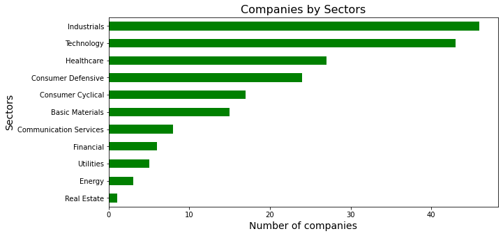
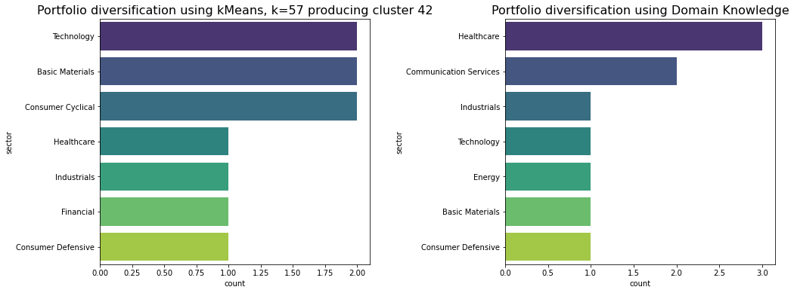

**2. Analyst's Recommendations**
- There are two fields representing the analyst's recommendations. However, the `recom_action` field consists of too many variations of the similar actions written in different ways. Therefore, the `recom_type` field will be more useful to be used in modeling. As such, we converted this field into an ordinal variable.

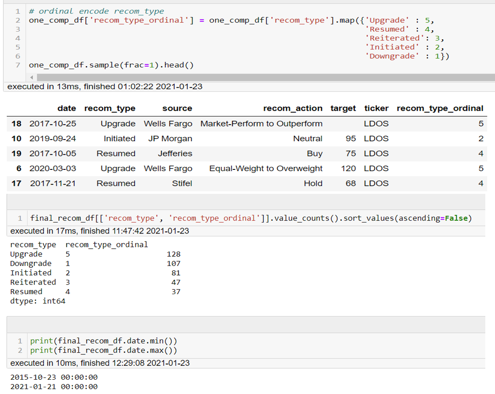

- The date rate spread of analyst's recommendation is about 5 yrs collectively for the companies in our portfolios. This is due to the limited amount of recommendations that were available on the website. We do not see this as an issue because generally prices react to more recent recommendations than old recommendations. As an investor, we generally do not look beyond 1-2 financial years.

- From the plot above, we can see that there is a good spread of analyst recommendations for the companies within our various portfolios. Analyst recommendations tend to have an effect on price movement where an upgrade recommendation tends to lift prices while a downgrade recommendation tends to depress prices.

**3. News Articles Sentiments**
- We can see that the length of news articles title range from 15 to 247 characters with a mean of 69 characters. Although we were using only the title of the news articles, it is generally deem to be sufficient as the style of stock market articles are written in a way to reflect the positive or negative effect on a company right off the bat to attract readers. Moreover, for the scope of this project, it will not be feasible to extract, parse and process all the articles words.

- Looking at the above examples of shortest and longest articles titles, we can confirm that even the shortest title with only 15 characters had clearly illustrated the intent of the article "Why SAP Is Down" to be a negative effect. On the other hand, the longest title also illustrated the intent of the article to be a positive effect.

**VADER Sentiment Scores**

- It will not be possible to derive the intent manually therefore we used VADER (Valence Aware Dictionary and Sentiment Reasoner) package to do the heavy lifting. FOr example:

   
- The pos, neu, and neg scores are ratios for proportions of text that fall in each category (so these should all add up to be 1 or close to it with float operation). These are the most useful metrics if you want multidimensional measures of sentiment for a given sentence.
    - positive sentiment: compound score >= 0.05
    - neutral sentiment: (compound score > -0.05) and (compound score < 0.05)
    - negative sentiment: compound score <= -0.05

**4. Historical Prices/Volumes**
- As the data set consist of open, close, high, low prices, etc for all companies in the portfolio, it will not be meaningful to perform EDA on these. A straightforward plot of the prices to spot any standout points will be sufficient.

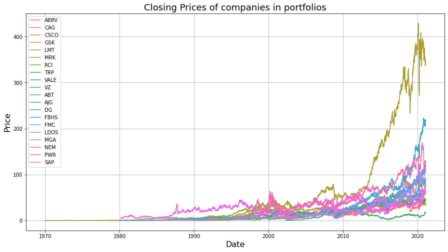

- We can see that there is a good spread of price ranges for the companies in our portfolios. There are periods of uptrend and downtrend. Company "LMT" seems to be the odd one out with very high price growth over the years. A quick check against the finviz.com website confirms that the trend is true and it is not a data error.

## PRE-PROCESSING

Similarly, the processes are well documented in the modeling notebook so we will be brief here. Note that there is no train-test-split done here because we are using the built-in `validation_split` function of LSTM, much like cross validation score.

There are several pre-processing steps involved and they are:

**1. Addition of Technical Indicators data**

- Several technical indicators are added to the data set and there are many more that could be added if the user has clear understanding of how those indicators work. Having more will increase the complexity of the model and computationally expensive for the scope of this project.
- Momentum indicators (SMA20, RSI14, MOM5), Volume indicator (OBV) and Volatility indicator (ATR14) are added using the `TA-Lib` package which calculate these indicators values based on the price and volume data provided.
- These technical indicators are then merged with all other data to form a complete data set for modeling.
- The modeling data set consist of 12 features and varying number rows (approx 3000 to 5000 rows) according to the company being ran.

**2. Scaling of Data**

There are three main choice of scalers, they are:

- **StandardScaler** removes the mean and scales the data to unit variance. However, the outliers have an influence when computing the empirical mean and standard deviation. Note in particular that because the outliers on each feature have different magnitudes, the spread of the transformed data on each feature is very different: most of the data lie in the [-2, 4] range for the transformed median income feature while the same data is squeezed in the smaller [-0.2, 0.2] range for the transformed number of households. StandardScaler therefore cannot guarantee balanced feature scales in the presence of outliers.

- **MinMaxScaler** rescales the data set such that all feature values are in the range [0, 1]. However, this scaling compresses all inliers into the narrow range [0, 0.005] for the transformed number of households. Both StandardScaler and MinMaxScaler are very sensitive to the presence of outliers.

- **RobustScaler** is based on percentiles and are therefore not influenced by a few number of very large marginal outliers. Consequently, the resulting range of the transformed feature values is larger than for the previous scalers and, more importantly, are approximately similar: for both features most of the transformed values lie in a [-2, 3] range. Note that the outliers themselves are still present in the transformed data. If a separate outlier clipping is desirable, a non-linear transformation is required.
    
**Decision** was to test all three scalers as majority of the literature research online could not conclude which scaler is the best for our project application context. Almost all literatures suggested to test all three and use the one with the best performance. In our context, we tested all three scalers and found that **MinMaxScaler** performed the best.

**3. Split and re-shape of data for LSTM**
- The input to every LSTM layer must be three-dimensional. The three dimensions of this input are:
    - Samples    : One sequence is one sample. A batch is comprised of one or more samples.
    - Time Steps : One time step is one point of observation in the sample.
    - Features   : One feature is one observation at a time step.
- This means that the input layer expects a 3D array of data when fitting the model and when making predictions, even if specific dimensions of the array contain a single value, e.g. one sample or one feature. When defining the input layer of our LSTM network, the network assumes that we have 1 or more samples and requires that we specify the number of time steps and the number of features. We do this by specifying a tuple to the “input_shape” argument.
- We automated this process with a series of helper functions to pre-process the data set into sequences. In our context, we have set Samples to be n_per_in=60, Time Steps to be n_per_out=1 and Features to be n_features=no. of features in the data set.

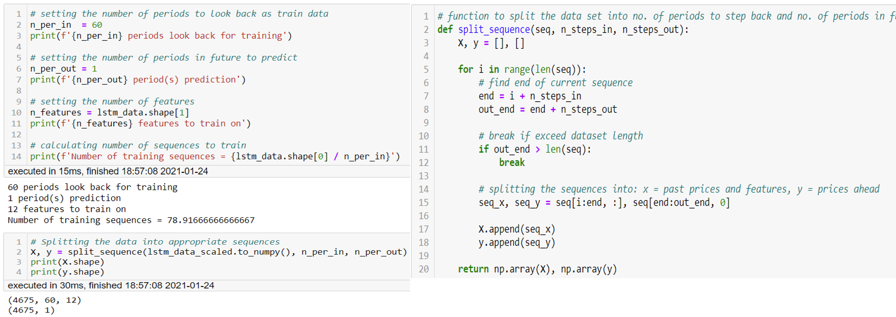

**4. Why 60 and 1?**

As our project is using daily prices, 60 periods in days is about one financial quarter. Most listed companies release quarterly results followed by analyst and news articles popping out in reaction to these results. Economic data are also often release quarterly, so collectively most of the stock price reaction in the market tend to move in tandem with these data and adjusting roughly by quarters. By feeding our LSTM model with 60 periods sequence data, it allows the model to learn the trend/behaviour of a quarter worth and by repeatedly feeding these sequences, the model would learn the long and short term weights of the features and its effect on price direction.

There is no particular reason for setting 1 period (or 1 day) as the prediction period. We just set it to 1 period so that it is easier when interpreting the results. However, intuitively we think that forecasting too far will not be ideal in our context as we are not working with data that have seasonality, unlike sales quantity or weather data.

## BASELINE

Traditionally, most modeling would use metrics like MSE, RMSE (for regression) or Accuracy, AUC-ROC (for classification) to compare baseline with their models. In our context, if we are only doing modeling for one company, we could use the same metrics. However, in real world investing it is never sufficient to be working with only one company. The real test is whether a portfolio of companies are collectively performing well.

Moreover, most attempts to predict an accurate future price have proven to be futile (we are predicting future direction not accuracy in this project). Especially given the nature that the stock market is frequently affected by a myriad of factors such as news, analyst recommendations, economic data, politics, financial reports, etc. Similarly, MSE/RMSE being a measure of the mean across a range of error values. It is inadequate to infer that stock prices difference will move within or close to this mean. We can see stock price rising/dipping ridiculously in a short period of time (e.g. Tesla, Alibaba, OLAM).

Therefore, traditional metrics like MSE/RMSE/Accuracy at best serve as a guidance in our context of searching for the optimal hyperparameters that produce the lowest mean standard error. This metric was used in the RandomSearch technique to return the best model with the lowest validation loss for MSE.

For our project context, our baseline will be set upon the total returns of all companies within the portfolios across long and short term horizons. In other words, the 20yrs and 1yr (separately) total returns for the Domain Knowledge Portfolio (without tuning) shall be our baseline.

The 20yrs and 1yr total returns for the Domain Knowledge Portfolio (with tuning) and the 20 yrs and 1yr total returns for the Kmeans Portfolio (with tuning); if higher than the baseline total returns would have proven that our LSTM tuned models had outperformed the portfolio.

As a sneak preview, our baseline total returns for 20yrs and 1yr is shown below.

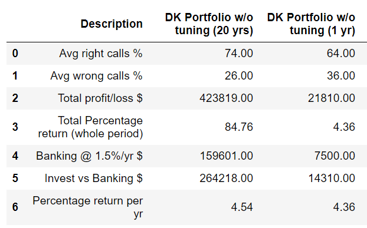

## MODELING, TUNING AND EVALUATION

**1. Modeling**

For the baseline model, we will be building a simple LSTM model that takes the input of 60 periods step back to predict 1 period in the future. Details of how LSTM works, activation function and why we choose LSTM instead of GRU is documented in the modeling notebook so we will not repeat it here.

The baseline model was kept simple with 1 input layer with 100 nodes, 1 hidden layer with 100 nodes and 1 output layer with 1 output node. In total about 125k parameters were trained.

Below is an example of the baseline model training result.

**2. Tuning**

Considering the large amount of permutations that can go into the LSTM neural network, we used the Tensorflow Keras RandomSearch package to assist in tuning our model. We define a custom function to dynamically create a LSTM model with random number of hidden layers and random number of nodes in each layers.

The three things we fixed are the output layer having 1 node, the Adam optimizer learning rate as 0.01 and limiting the hidden layers to maximum 2 layers. In order to prevent over fitting, we added a Dropout layer to every hidden layer.

The RandomSearch tuner is then called to perform maximum 3 trials (i.e. 3 random permutations) and 2 executions per trial (i.e. train 2 times per trial). Note that because of the purpose of reproducibility for academic explanation, we forced the random seed to be '42' in the entire notebook. If we want to truly tune for the best hyperparameters, there should not be a seeding here.

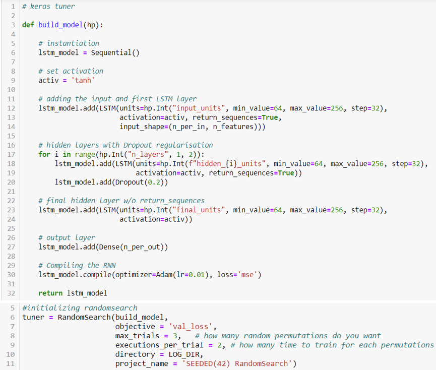

Below is an example of the search space summary seeded to 42.

**3. Evaluation**

We compiled the LSTM model and set the "loss metric" to MSE and with this metric the Keras RandomSearch will execute the specified number of trials while keeping track of the best model with the lowest validation loss. The best model will be returned as shown below.

Below is an example of visualizing the validation loss result of a best model.

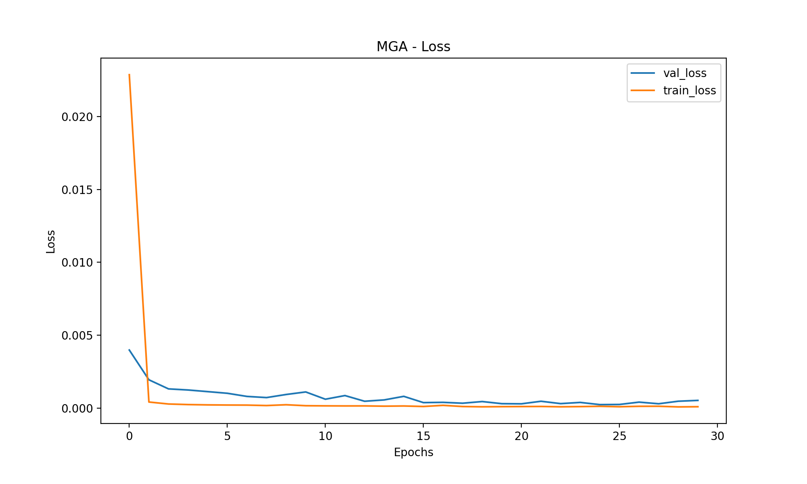

**NOTE**: It is important to remind that MSE/RMSE is used as a metric to evaluate the performance of the various models executed in the trials. It is not a metric used to determine the performance of this project. The project evaluation metrics or objectives are explained in the Problem Statement section above.

After running the best model, we overlay the analyst's recommendations and news sentiments onto the last prediction sequence to get a visualization of how one prediction sequence turns out.

In this example for a sequence of 60 periods, we can see that there was a good amount of new and analyst's recommendations. These would have contributed to the model learning of price patterns in this sequence.

This example illustrated that with neural network inner workings, it is not always possible to decipher why a certain result occurs. Much more so when we are modeling stock prices among many other features data. However, we have to also remember and appreciate that interpreting and processing these large amount of data manually is impossible without the help of machine learning.

With each best model returned by Keras RandomSearch function, we subject each company in the various portfolios through the same process to finally compile a complete set of results for our final analysis and conclusion into whether we have achieved the project objectives.

## TRADING STRATEGY AND TRADING ROBOT

**1. Creation of Trading Account Class AND Trading Robot**

- A new Trading Account Class object was created to store and perform trading actions arising from our trading strategy in subsequent stage. This class takes care of the initialization of account, deposit, withdraw, balances, freezing/unfreezing whenever call for while executing the trading strategy.
- Helper functions are created to handle the records keeping task of our trading actions. This will allow us to review and audit the trade actions to ensure it was done correctly as planned and it can also help us to fine-tune the trading strategy. For example:

**2. Evaluating Trading Strategy and Rules**

To ensure that the Trading Account Class and Trading Robot functions work as planned in our back testing. The implemented a number of rules and perform auditing of one test company transactions. Details are well documented in the modeling notebook so we will be brief here.

**SIMPLE STRATEGY - Buy low, Sell high, No short, Never pay min commission/fees**

In order to make a complete and meaning assessment of the ML model, the best way is to apply the predictions and backtest them over a period to simulate a real investment. There are ready made backtesting libraries out there but we decided to build our own from scratch because only in this way can we look under the hood to evaluate and audit if our model and trading strategy actually work as intended.

We shall design a simple strategy that gives absolute trust to the model's predictions and taking no risk at all based on the following rules.

1. Whenever tomorrow close price is predicted to be higher than today close price by a predicted percentage gain. We shall buy at tomorrow open price.
2. Whenever tomorrow close price is predicted to be lower than today close price. We shall sell everything on hand at tomorrow open price.
3. At all time, there will be no short selling transaction.
4. In all buy trades, we will adjust the trade size such that the commission/fees is not lower than the min fees.
5. In all sell trades, we will not enter a sell trade if the resulting predicted gain is lower than the min fees.

For each company, we standardize their starting conditions as such.

    # setting account starting balance and pred_pct_gain in daily prices before making a trade
    acct_start_bal = 50000
    pred_pct_gain = 1.05

    # setting commission and fees (based on DBS OET US market fees)
    comm_rate = 0.0015 # 0.15% on trans_amount each time but a min. of $18 will be imposed in the buy/sell functions
    min_fees = 18
    
The portfolios were subjected to this backtesting strategy over a long term investment horizon of 20 yrs as well as a shorter 1 yr horizon. This will truly be a complete evaluation of our "un-tune" vs "tuned" models over different investment horizon and compare between a domain knowledge portfolio vs a unsupervised learning Kmeans portfolio.

**3. Auditing Transactions**

In order to ensure that the back test strategy is executed according to our plan, we perform an audit of some of the transactions on the test company (CSCO). This serves as a validation evidence that no cheating is involve in the codes to make this look good.

The audit process involve two steps:

1. Strategy execution
- Export to excel to color label the cells to trace a buy and sell decisions and if the correct calculations are being applied.

2. Strategy effectiveness
- Adding "real_trend" and "right_call?" columns and populate them correctly based on actual data. Then comparing them to predicted data to determine the percentage of correct transaction decisions.

**Step 1 - Strategy execution**

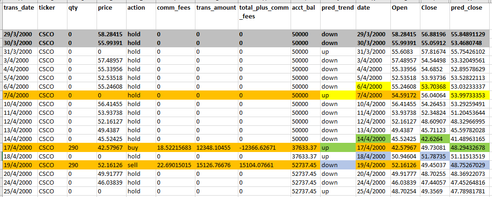

**Note:** Let us briefly explain the key audit points.

**Reference: Grey cells**
- Complied with "No short selling" rule despite predicting a lower closing price for next day

**Reference: Yellow cells**
- End of 6/4/2000, predicted next day closing price to be higher and recommended a buy action
- However, it failed the "min. predicted gain percentage" rule. Hence, no trade conducted (orange cells)

**Reference: Green cells**
- End of 14/4/2000, predicted next day closing price to be higher and recommended a buy action
- Complied with "min. predicted gain percentage" rule. Hence, executed a buy trade (orange cells)
- Buy trade was executed at next day opening price (orange cells) and quantity was adjusted to ensure commission/fees is not lower than the min fees of $18

**Reference: Blue cells**
- End of 18/4/2000, predicted next day closing price to be lower and recommended a sell action
- Complied with "min. predicted gain percentage" rule. Hence, executed a sell trade (orange cells)
- Sell trade was executed at next day opening price (orange cells) and quantity was sell everything on hand

In summary, the entire strategy was executed according to the rules and plan that we have set. PASS!

 **Step 2 - Strategy effectiveness**
 
 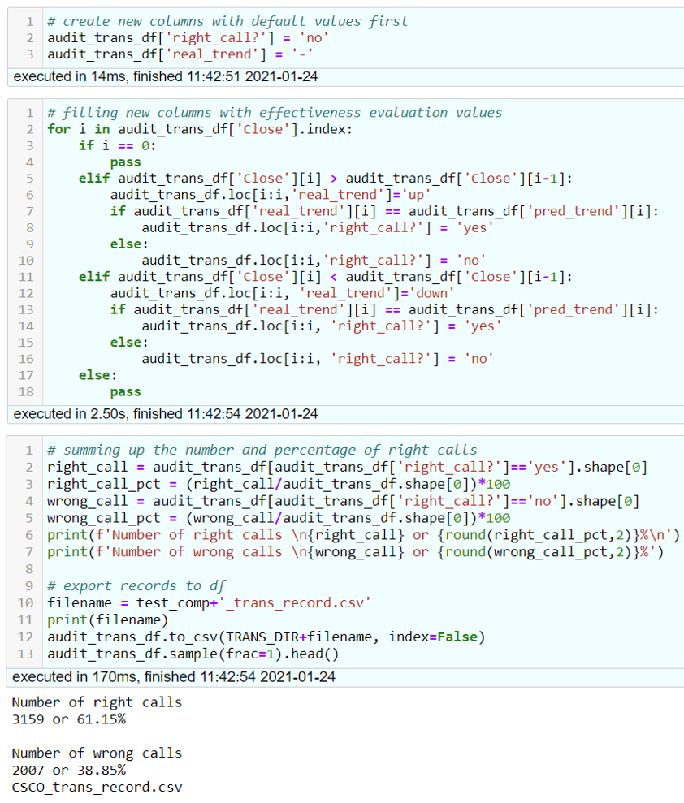

With the above codes, we created new columns to keep track of right or wrong calls. Note that "right calls" refer to the situation where the predicted trend match with the actual trend and the opposite for "wrong calls". However, even a 0.00001 cent different will be treated as either a right or wrong call. Therefore, even though in this example of CSCO, the number of right calls or right calls % is high. It does not automatically mean that the model prediction accuracy is good. It also does not mean that we had made a trade for each of these occurrences.

This is also the reason for implementing a "min. predicted percentage gain" rule before executing a trade, so as to mitigate the effect of wildfully acting upon every single trade call without any regard for the magnitude of value change in prices. It is of course still a good measure if the model can achieve a very high right calls percentage as the probability of making a profitable trade will be increase.

## CONCLUSION AND RECOMMENDATION

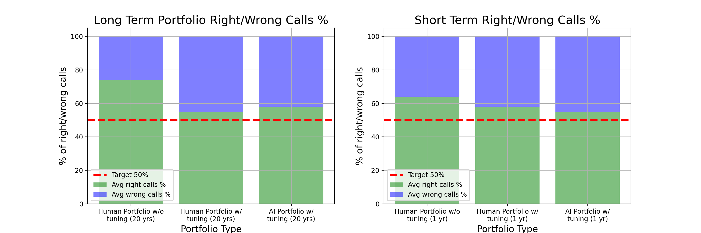

Based on this project findings on the 3 portfolios (DK w/o tuning, DK with tuning and Kmeans with tuning) backtested on both long-term and short-term horizons. We are able to conclude the follow points:

**INVESTING METRICS OF SUCCESS**

**1. To achieve above 50% of right calls**

- In most of the results, despite having an overwhelming number of "right calls", there were not many trades conducted. This is because of the "min. predicted percentage gain" and "no short" rules defined in our strategy. Another possibility especially for the long term portfolios, could be due to running out of money to perform a buy prediction.

- The more important measure to note is the number of "right call" for each company was mostly higher than the number of "wrong calls", with only 3 exceptions which we investigated that it was most likely due to insufficient tuning. However, we concluded that all 3 portfolios achieved above 50% of right calls. Although the DK without tuning portfolio had the highest percentage of right calls, it is likely to be due to the LSTM model over fitting to the data sequences. Whereas, the tuned models had Dropout regularization built-in.

- The modeling metric of MSE/RMSE can only be used to evaluate which one of the various trial models for each company is better. i.e. out of three trials for company A, trial no 1 hyperparameters gave the lowest MSE/RMSE. It does not make sense to compare the MSE/RMSE between companies because the data set and LSTM model neural network is different.

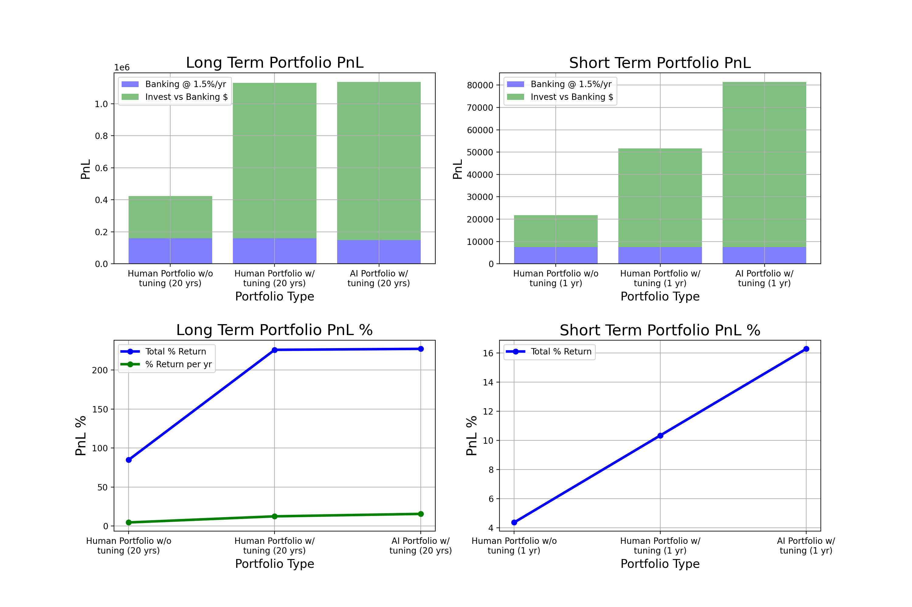

**2. To achieve positive returns (min. 5%) higher than bank interest (assumed 1.5% per yr)**

- Given an initial capital of 50K per company, we simulated trading the 3 portfolios in long and short term horizons. We concluded that all three portfolios achieved this objective. This reinforced that LSTM neural network model can indeed be used to predict price trends of company stocks. The 2 tuned portfolios performed much better than the un-tuned portfolio and this further cement the evident that with sufficient tuning and more data, the LSTM neural networks can outperform generic models by a large margin.

- The 2 tuned portfolios turned the 500K for 10 companies into more than 1.1 mil in profits or more than 220% returns over 20 yrs. On the short term horizon, the 2 tuned portfolios were able to generate between 10% to 17% additional returns from the 500K. In other words, all portfolios in long and short term horizon, made more money than collecting bank interest for the 500K.

**TECHNICAL PERSPECTIVE SUCCESS**

From a technical perspective, we managed to complete the project with moern data science techniques.

**1. To assemble a viable portfolio using unsupercised machine learning techniques.**

- The Unsupervised Learning Kmeans clustering portfolio did equally well against the Domain Knowledge portfolio. Hence, we conclude that Kmeans clustering technique is a viable method to assemble a portfolio of stocks in comparison to the time-consuming manual selection using fundamental indicators analysis.

**2. To build viable deep learning LSTM models for stock price trend prediction.**

- Within the parameters of this project, we conclude that the LSTM tuned models outperform the un-tune LSTM model while the un-tune model performed positively as well. Hence, we are also able to conclude the LSTM neural network is a viable method to model stock price prediction.

**RECOMMENDATION**

We recommend the following improvements from both investment business perspective and technical perspective.

1. To acquire more data such as diversity of analyst's recommendations and news articles in addition to finviz.com. Some alternative sources are mentioned in the README file.
2. To include more technical indicators, financial statements, economic data, etc. into the data set.
3. To establish a few Unsupervised Learning portfolios and increase the number of companies in each portfolio to further diversify the risk.
4. To incorporate a image classification model that can differentiate technical trends based on candlestick charts.
5. To re-tune the LSTM model every 20 periods (about 1 month) with fresh data to keep the model up to date with latest price movements.
6. To fine-tune the trading strategy and rules to include short-selling and auto-triggering of transactions with Trading Brokerage APIs.
7. Design a data pipeline and deploy the auto-tuning on a stipulated schedule on a platform with more computational resources.
8. Design a dashboard to easily track the portfolio performance regularly.

**THE END, THANK YOU**
