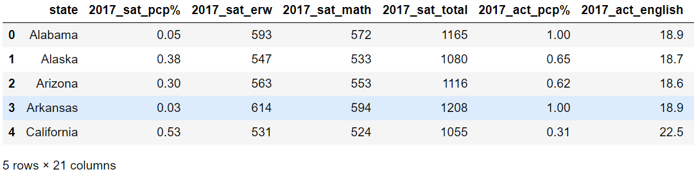
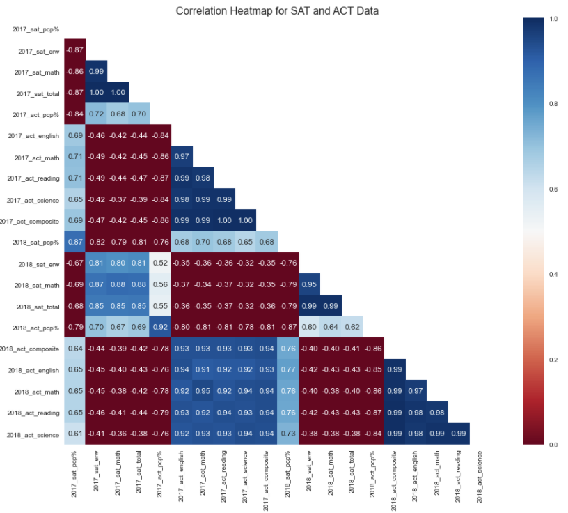

# Project 1: Standardized Testing, Statistical Summaries and Inference

# 2017 & 2018 SAT/ ACT Data Analysis

_Prefix: If is strongly recommended that you read this file together with the Python code file and the presentation file together._

# Problem statement

The new format for the SAT was released in March 2016. Imagining myself as an employee of the College Board - the organization that administers the SAT and tracks statewide participation. I will attempt to use statistical methods and data analysis techniques with the help of Python to recommend where money is best spent to improve SAT participation rates.

A combination of analysis into the provided data and outside research should give recommendations about:

### How the College Board might work to increase the participation rate in a state of my choice.

# Executive Summary

### Contents:
1. [Data importing and cleaning](#1.-Data-importing-and-cleaning)
2. [Data Dictionary](#2.-Data-Dictionary)
3. [Exploratory Data Analysis](#3.-Exploratory-Data-Analysis)
4. [Mapping data in Tableau](#4.-Mapping-data-in-Tableau)
5. [Descriptive and Inferential Statistics](#5.-Descriptive-and-Inferential-Statistics)
6. [Conclusion and recommendations](#6.-Conclusion-and-recommendations)

## 1. Data importing and cleaning
[back to contents](#Contents:)

2017/2018 dataset were provided as csv files, upon importing into Python there were issues identified that required data cleansing to get a complete and clean dataset. Details of actual work done can be found in the Python code file. These included:
- Columns renaming and datatypes standardization
- Correction of data values errors as compared to the actual web data (eg. values and Min/Max range of test scores)
- Removal of unnecessary symbols and text that may cause computational errors
- Merging of 2017 and 2018 data into a final dataset (filename: [final.csv](../data/final.csv) in the "data" folder)

__Preview:__

## 2. Data Dictionary
[back to contents](#Contents:)

After getting a clean and complete final dataset, we were able to collate a Data Dictionary as follows:

*Note that some additional columns were added but are not reflected in this dictionary. This is because those columns were meant to be temporary to facilitate analysis.*

|Feature|Type|Dataset|Description|
|:---|:---|:---|:---|
|state|string|SAT|State name eg. Alabama|
|2017_sat_pcp%|float64|SAT|Participation rate eg. 0.05(i.e. 5%)|
|2017_sat_erw|int64|SAT|Average Score for Evidence-Based Reading and Writing eg. 593|
|2017_sat_math|int64|SAT|Average Score for Math eg. 572|
|2017_sat_total|int64|SAT|Average Score for Total eg. 1165|
|---|---|---|---|
|2017_act_pcp%|float64|ACT|Participation rate eg. 0.5(i.e. 50%)|
|2017_act_english|float64|ACT|Average Score for English eg. 18.9|
|2017_act_math|float64|ACT|Average Score for Math eg. 18.4|
|2017_act_reading|float64|ACT|Average Score for Reading eg. 19.7|
|2017_act_science|float64|ACT|Average Score for Science eg. 19.4|
|2017_act_composite|float64|ACT|Average Score for Composite eg. 19.2|
|---|---|---|---|
|2018_sat_pcp%|float64|SAT|Participation rate eg. 0.06(i.e. 6%)|
|2018_sat_erw|int64|SAT|Average Score for Evidence-Based Reading and Writing eg. 595|
|2018_sat_math|int64|SAT|Average Score for Math eg. 571|
|2018_sat_total|int64|SAT|Average Score for Total eg. 1166|
|---|---|---|---|
|2018_act_pcp%|float64|ACT|Participation rate eg. 1.0(i.e. 100%)|
|2018_act_composite|float64|ACT|Average Score for Composite eg. 19.1|
|2018_act_english|float64|ACT|Average Score for English eg. 18.9|
|2018_act_math|float64|ACT|Average Score for Math eg. 18.3|
|2018_act_reading|float64|ACT|Average Score for Reading eg. 19.6|
|2018_act_science|float64|ACT|Average Score for Science eg. 19.0|
    

## 3. Exploratory Data Analysis
[back to contents](#Contents:)
    
**(a)  Standard Deviation Analysis**
   
A quick analysis of the standard deviation (SD) of all the variables gave us a sense of spread of data from the mean of each variable. Although there is a slight difference in the SD when we used manually calculation; numpy.std and the pandas.describe() methods. The difference is negligible and the difference is due to:
   - The np.std() function has “Delta Degrees of Freedom” (ddof) parameter which by default is zero. By default numpy uses the _population standard deviation_. This is used if you have a _complete data set_.   
   
   
   - The pandas .describe function is calculating the _sample standard deviation_. This has a divisor of N-1, and is used when you have a _subset of data from a larger set_. This can also be achieved in numpy by np.std(a, ddof=1).   
   
   
   - The Manual method is dependent on how we create the formula to control using N or N-1.

In this case, the difference is negligible but it is important to know the difference in application of the three methods against different types of sample. A quick glance over the std and mean of each variable, as a general rule of thumb if the std is less than 1/3 of the mean, it is consider normal. The only exceptions are the % denominated variables (eg. sat_pcp%) which is exactly the variables that we are trying to consider in this analysis as to why some states have very high or very low participation rates.

**(b)  Participation Rate vs Performance**

[back to contents](#Contents:)
   
Using Python we were able to filter the data for:
- states with highest/lowest SAT/ACT participation rates in 2017/2018

- states with the highest/lowest SAT Total Scores/ACT Composite Scores in 2017/2018

- states with 100% participation on a given test with a rate change year-to-year
   - _Colorado_ stood out from the list with the biggest increase for SAT participation rate from 11% to 100%, as well as being the state with the biggest decrease for ACT participation from 100% to 30%

- states with >50% participation on both tests either year
   - _Florida_ stood out from the list with the biggest decrease for SAT participation rate from 83% to 73%, while also having the biggest decrease for ACT participation rate from 73% to 66%
   
**Heatmap**  Thru the use of a Seaborn Heatmap in python,

We observed the following points:

- Mean scores on a given test are highly negatively correlated with participation rate on that test (r ~ -0.8). This directly indicates the earlier observation of higher scores on SAT had lower SAT participation rate and higher ACT participation rate had lower ACT scores).

- Mean scores on sections of a given test are highly correlated (r ~ 0.9 to 1.0) with mean scores for other sections of that test, or total scores for that test.

- Mean scores on sections of the SAT are moderately negatively correlated with mean scores on ACT, and vice versa (r ~ -0.6).

- Participation rate on a given test is moderately positively correlated with scores on the opposite test (r ~ 0.6). Again, this directly indicates the earlier observation of higher scores on SAT had lower SAT participation rate and higher ACT participation rate had lower ACT scores). Contributing to positive correlation between SAT participation and ACT scores.

**Histogram**  Thru the use of Python Histogram on SAT/ACT participation rates, we observed the following points:
_(Details of plots are in the code file)_

- The distributions for SAT participation rate and ACT participation rate had not changed dramatically from 2017 to 2018. It is also clear that the SAT had a large group of very low participation rates (<10%), a cluster of states with participation in the 50-75% range, and then a group of states with 100% participation.

- The ACT had almost no states with lower than 10% participation, had a cluster of states in the 15-40% range, only a small number of states in the mid to high range, and then a large group of states with almost or 100% participation.

- In this way the two distributions almost mirror each other and follow a bimodal distribution with two peaks.

**Patterns observed**
_(Details of plots are in the code file)_

We also applied Python Histogram and Seaborn Displot to selected variables and observed their distribution patterns. Details of these observations can be found in the code file. Particularly we observed two kinds of distribution patterns which were Bimodal distribution or a Skewed Normal distribution (unimodal). The pattern observations details can be found in the code file.

In essence, we generally assume that data we sample from a population will be normally distributed. This means that if we take a sample of size 𝑛=50 (number of states in this case) and find the mean of that sample, then do it for all possible samples of size 𝑛 , this distribution of sample means tends to be Normally distributed as long as 𝑛 is big enough. Although we have observed only Bimodal and Skewed Normal distributions, and according to Central Limit Theorem, if we can get more sample means from these data and plot it again, the sampling distribution of the sample means will approach a Normal Distribution. Therefore, estimates made from these data are likely to be Normally Distributed as well.

**(c)  Scatter plots**
_(Details of plots are in the code file)_

[back to contents](#Contents:)

Using Seaborn scatter plot on:
- SAT Math/ACT Math, SAT Evidence-Based Reading and Writing/ACT Reading and SAT Total Scores/ACT Composite in the same year, there was no strong correlation between the pairs.

- SAT Total Scores between years and ACT Composite Scores between years, there was a strong positive correlation between the years.

**(d)  Box plots**
_(Details of plots are in the code file)_

[back to contents](#Contents:)

Using Seaborn boxplot on:
- SAT Total Scores and subject scores, we did not observe any significant variation between the years other than a slight drop in mean scores.

- ACT Composite Scores and all ACT subject scores, we observed a consistent drop in mean scores.

- SAT and ACT Participation Rate, we observed the distribution of ACT Participation Rate across the 50 states is centered significantly higher than that of the SAT. This can also mean that across the 50 states, ACT is preferred over SAT.

Additionally, we plotted scatter plots on SAT Participation Rate vs SAT Total Scores and ACT Participation Rate vs ACT Composite Scores to see if there is any correlation. We observed that ACT and SAT scores are inversely correlated with their respective participation rates. This is likely due to selection bias, as low participation means those who are participating tend to be higher achieving, and high participation means diluted quality of performance.

## 4. Mapping data in Tableau
[back to contents](#Contents:)

As an optional visualization, we created a chloropleth map of the 50 US states showing the breakdown of their respective SAT/ACT Participation and subject scores.

The chloropleth map an be access [here](https://public.tableau.com/profile/jeffrey.sim2093#!/vizhome/GA-DSIProject1/2018SATACT?publish=yes). Mouseover each of the states will show the breakdown of the scores. Note: Only plotted 2018 data instead of every variable.

## 5. Descriptive and Inferential Statistics
[back to contents](#Contents:)

**(a)  Participation rate**

Participation rate had a huge impact on state average SAT/ACT scores.

_Relationships between populations sizes & rates:_

- Low participation states have lesser people taking the tests. However, these people are usually the ones who need to pass the tests and put in more effort to get better scores. This results in bias and artificially higher scores.

- High participation state have more people taking the tests. However, these include the good performers and the bad performers. This also results in bias and artificially lower scores.

_Granularity and aggregation:_

- How the participation rates are being aggregated also makes a difference. If it is simply aggregating the average participation rates of each school in each state, it will not be accurate because it is an average of an average. However, if the aggregation method is to take the total number of test takers against the total number of qualified/eligible test takers in the state in the year. It will have better accuracy.

Considering the above, we will still attempt to conduct inference with these data because until statistically tested with relative confidence level, it will be too early to reject any hypothesis on these data. In the code file, there is **an example of conducting statistical inference on SAT/ACT Math to demonstrate this point.**

**(b)  Identifying States of interest**

[back to contents](#Contents:)

Using simple bar charts in Python to plot the 2017/2018 SAT/ACT Participation Rates, we were able to easily identify the following states of interest:
- From the SAT chart, Colorado and Illinois who had significant increase in 2018 SAT participation rate as compared to 2017 while at the same time had significant reduction in their ACT Participation Rate.

- From the ACT chart, Alaska, Colorado and Illinois had significant reduction in 2018 ACT participation rate as compared to 2017.

Therefore, **Alaska, Colorado and Illinois** are chosen as the three states to be investigated further.

**(c)  Outside Research**

[back to contents](#Contents:)

**Investigating Colorado and Illinois had significant increase in 2018 SAT participation rate as compared to 2017**

- According to various articles found online, both states implemented mandatory SAT testing as well as the allowing contracts with the ACT to expire.
    - (source: https://www.testive.com/state-sat-act/), Colorado and Illinois were still listed as states that require the ACT in the year 2017-2018.
    - (source: https://blog.prepscholar.com/which-states-require-the-sat), three key points mentioned for the states of interest:
        - As of the 2016-17 school year, all Colorado juniors in public schools will take the SAT.
        - Beginning with the 2016-17 school year, all Illinois juniors must take the SAT.
        - Schools or districts can administer the SAT to their students (either as an option or a requirement). These states include Alaska...  
    - (source: https://reports.collegeboard.org/archive/sat-suite-program-results/2018/sat-school-day), in 2017-18, 10 states (Colorado, Connecticut, Delaware, Idaho, Illinois, Maine, Michigan, New Hampshire, Rhode Island, and West Virginia) and the District of Columbia covered the cost of the SAT for all their public school students.
    - (source: https://www.chicagotribune.com/news/breaking/ct-parcc-test-high-school-met-20160711-story.html). Quote - "Illinois is ditching the controversial state PARCC exam for high school students, instead giving 11th-graders a state-paid SAT college entrance exam next spring. The announcement from the Illinois State Board of Education on Monday comes after only two administrations of PARCC, in the spring of 2015 and 2016, following dismal test scores and thousands of students skipping the exams. For many years in the past, the state gave a free and popular ACT college entrance exam to roughly 140,000 high school juniors. ACT's contract expired, and there was no state-paid college entrance exam for students in spring 2016, although some districts paid for it on their own. ISBE chose this past school year to switch to the SAT, which O'Mara said is expected to be to given in April 2017."
    

- Since the participation rate increase was significant, there may be an impact to these states' SAT and ACT scores. To investigate the correlation of this impact, we used scatter plots and we saw that there was a high correlation between SAT Total score in 2017 and 2018 for each state. There were a few exceptions where we see that states have dropped off from 2017 to 2018.

- If we look at Colorado, the SAT total score fell from 1201 to 1025. This is likely attributable in part to a large increase in SAT participation (11% in 2017 to 28% in 2018), which might dilute the quality of the average score. However, this fails to explain the scale of the drop entirely, given that Illinois only saw a drop from 1115 to 1019 with a much larger increase in participation (9% participation in 2017, 99% in 2018).

**Investigating Alaska, Colorado and Illinois had significant reduction in 2018 ACT participation rate as compared to 2017**

- According to various found online, we knew that some states made it compulsory to take SAT or ACT while some do not. We also knew that some states paid for the tests and these tests were not cheap, even more costly if test takers chose to take the writing portions.
    - (source:https://www.testive.com/state-sat-act/), none of Alaska, Colorado and Illinois are listed as states that require the ACT.
    -  (source:https://www.adn.com/alaska-news/education/2016/06/30/students-no-longer-need-national-tests-to-graduate/#:~:text=The%20SAT%20and%20ACT%20cost,district%20fee%20for%20the%20diplomas), Alaska's high school students no longer need to take the SAT, ACT or WorkKeys test to get their diplomas. The state law requiring the college or career readiness tests expired Thursday. As of now, the Class of 2017 will only need to meet credit requirements to get their diplomas, said Margaret MacKinnon, director of assessment and accountability at Alaska's state education department.
    - According to this article (source:https://www.usnews.com/education/best-colleges/articles/2018-01-23/how-to-take-the-sat-act-for-free#:~:text=Test%2Dtakers%20must%20pay%20%2449.50,other%20changes%20in%20test%20administration), Test-takers must pay USD49.50 to register for the SAT or USD52 for the ACT, according to the College Board and ACT websites. For test versions that include writing portions, the SAT costs USD64.50 and the ACT runs USD68. Other fees may apply to both exams for late registration or other changes in test administration. There are also states that will pay the bill for the SAT and ACT for public school students. (Note: I extracted the paying states from this link as well)

- It is then interesting to determine the correlation (if any) between participation rate and whether the states pay for it or not. By compiling a list of states who paid for the tests and adding it to the data frame, we were able to use Seaborn scatter plot with "paying_states" as a category hue.

- From the SAT scatter plots, we observed that almost all states who had above 80% participation rate, had their test fees paid by the states. Colorado and Illinois both saw significant increase in SAT participation rate when the states started paying the SAT fees in 2017-2018. Also since both states still required either the SAT and ACT, it was not surprising to see ACT participation rate dropping as more test takers switch to the free SAT test.

- We also observed that there were alot of states lying between 50-80% participation rate but test fees were not paid by the states. Given the high positive correlation of the 2017 and 2018 Participation rate, it was very possible that if the non-paying states in the 50-80% participation rate, started to pay for the test fees as well. We could see further participation rate increase.

- As for ACT scatter plot, the same can be observed but there were a greater number of non-paying states in the 20-80% participation rate region. If these non-paying states started to pay for the test fees, the ACT participation rate is likely to increase. Interestingly, **none** of Alaska, Colorado and Illinois were listed as states that require the ACT. This further supports the drop in ACT participation rate. Moreover, Alaska did not pay for either SAT or ACT test fees.

## 6. Conclusion and recommendations
[back to contents](#Contents:)

The ACT and SAT participation distributions roughly mirror each other, with states tending to prefer one test or the other based on bias of **whether SAT or ACT is required** in that state and **whether the state is paying for the tests or not**.

**ACT and SAT scores are inversely correlated with their respective participation rates.** This is likely due to selection bias, as low participation means those who are participating tend to be higher achieving, and high participation means diluted quality of performance.

It is recommended that the College Board takes into consideration, **household income data especially for states with low participation rate and is currently a non-paying state.** The analysis had shown a correlation in this aspect that makes it worth further investigation.

The analysis had yielded a list of states with **low participation rate and is currently a non-paying state**, of which the College Board could work with to share and implement support and fiscal policies that were put in place in states with high participation rate. In particular, our analysis specifically identified **Alaska** as a potential working target.

Thank you.
