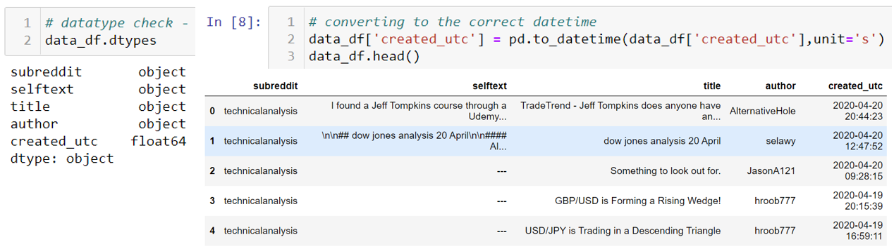

# Project 3 - Reddit.com Web APIs & Classification

<h1>Table of Contents<span class="tocSkip"></span></h1>
<div class="toc"><ul class="toc-item"><li><span><a href="#Problem-Statement" data-toc-modified-id="Problem-Statement-1"><span class="toc-item-num">1&nbsp;&nbsp;</span>Problem Statement</a></span></li><li><span><a href="#Executive-Summary" data-toc-modified-id="Executive-Summary-2"><span class="toc-item-num">2&nbsp;&nbsp;</span>Executive Summary</a></span></li><li><span><a href="#Data-collection-and-importing" data-toc-modified-id="Data-collection-and-importing-3"><span class="toc-item-num">3&nbsp;&nbsp;</span>Data collection and importing</a></span></li><li><span><a href="#Data-dictionary" data-toc-modified-id="Data-dictionary-4"><span class="toc-item-num">4&nbsp;&nbsp;</span>Data dictionary</a></span></li><li><span><a href="#Data-cleaning" data-toc-modified-id="Data-cleaning-5"><span class="toc-item-num">5&nbsp;&nbsp;</span>Data cleaning</a></span></li><li><span><a href="#Exploratory-Data-Analysis" data-toc-modified-id="Exploratory-Data-Analysis-6"><span class="toc-item-num">6&nbsp;&nbsp;</span>Exploratory Data Analysis</a></span></li><li><span><a href="#Pre-processing-Train-Test-Split" data-toc-modified-id="Pre-processing-Train-Test-Split-7"><span class="toc-item-num">7&nbsp;&nbsp;</span>Pre-processing Train-Test-Split</a></span></li><li><span><a href="#Baseline" data-toc-modified-id="Baseline-8"><span class="toc-item-num">8&nbsp;&nbsp;</span>Baseline</a></span></li><li><span><a href="#Modeling-Tuning-and-Evaluation" data-toc-modified-id="Modeling-Tuning-and-Evaluation-9"><span class="toc-item-num">9&nbsp;&nbsp;</span>Modeling Tuning and Evaluation</a></span><ul class="toc-item"><li><span><a href="#Hyperparameters-GridSearch-range-and-best-params-comparison" data-toc-modified-id="Hyperparameters-GridSearch-range-and-best-params-comparison-9.1"><span class="toc-item-num">9.1&nbsp;&nbsp;</span>Hyperparameters GridSearch range and best params comparison</a></span></li><li><span><a href="#Models-evaluation" data-toc-modified-id="Models-evaluation-9.2"><span class="toc-item-num">9.2&nbsp;&nbsp;</span>Models evaluation</a></span></li></ul></li><li><span><a href="#Conclusion-and-recommendations" data-toc-modified-id="Conclusion-and-recommendations-10"><span class="toc-item-num">10&nbsp;&nbsp;</span>Conclusion and recommendations</a></span></li></ul></div>

## Problem Statement

In this project, we are a group of analysts working in an investment advisory firm serving equity market investors. The advisory services are broadly focused on the domains of Value Investing (long-term) and Trend-based Investing (short-medium term). The firm's marketeers have been trolling two subreddits (`r/ValueInvesting` and `r/technicalanalysis`) from reddit.com in the past few years to identify authors who may be inclined towards either of these domains in order to offer targeted marketing to them. A database was maintained over years containing respective author's posted contents, which subreddit it came from, date/time along with other information.

Recently, a new marketing intern accidentally deleted the subreddit's database. Although most data were salvaged, the subreddit's source column amongst other lost data was not retrievable. The source column was critical to marketing team's effort in delivering appropriate marketing materials to the authors according to their investment inclination. The only way to retrieve that information was to try scrapping the subreddits for all contents. This is not possible as the duration was too dated too far back, reddit.com only allow around 1200 posts to be scrapped at any one time and it will take a very long time to sort thru the data. Moreover, the two subreddits were highly correlated in words used that made it even harder for the marketing team to manually decipher in a short time.

The furious firm's Marketing Director requested that the analyst team **find a way to process the salvaged data and re-classify them as accurately as possible into the respective subreddits.**

The analyst team found this to be a binary classification problem. The data to train and evaluate the model could be scrapped using reddit.com's JSON API. We can use a Natural Language Processor to train a classifier model to predict from which subreddit a given post came from.  Armed with this information, the team proceeded with obtaining the data and building the classification model.

**The overall success of the prediction model shall be based upon its Accuracy and a balance of other metrics like Sensitivity, Specificity and Precision.**

## Executive Summary

Losing data is a detrimental disaster to any investment advisory firm, especially data that was accumulated over years that was used to identify and target potential clients according to their investment inclination. Our firm had been utilizing reddit.com's subreddits of "ValueInvesting" and "TechnicalAnalysis" to target and offer our long term and short-medium term investment advisory in the equity market. A new marketing intern accidentally deleted critical information from the database that helped the market team classify whether a potential client was an active author in either subreddits.

Although part of the lost data was salvaged, the subreddit identification columns were not recoverable. It will take too much time and effort to re-acquire those data and to re-classify them. The firm needed to find a way to process the salvaged data and re-classify them as accurately as possible into the respective subreddits.

The analyst team noted that this was a binary classification problem and there are many machine learning models that could be used for such problems. The lost data could also be quickly re-acquire using a combination of techniques such as web scrapping and JSON API. A Natural Language Processor could be deployed to train a classifier model that will give the predictions as to which subreddit a post came from. The only question remain was the accuracy of such a model.

With these solution possibilities, the team went on to re-acquire as much data as possible and perform exploratory data analysis to validate the suitability of the acquired data before moving to the next steps. Once data suitability had been confirmed, the data went through pre-processing steps to established a baseline accuracy as a benchmark to evaluate other models. Four models were tested and had their parameters tuned to establish the best model for this purpose. The models were evaluated across Accuracy, Sensitivity, Specificity, Precision and ROC AOC curves. Even mis-classifications were examined to ensure there was no blindspot.

A 'best' model that combined TF-IDF Vectorizer and Logistic Regression was established with a high accuracy of 94.25% when tested. Although futher hyperparameters tuning could be perform to attempt in finding a better model/parameters. A trade-off between bias and variance would be necessary. Some recommendations were discussed to further enhance the models at the end of this report should the need arises. However, at an accuracy of 94.25% and given the urgency of this project. The analyst team concluded the best model to resolve the firm's problem. Let's take a look at the project approach.

## Data collection and importing

Data was collected using a custom function that can be found in this file ["get_data.ipynb"](get_data.ipynb). The function sent repeated requests to reddit.com and obtained 25 posts each run, running for 50 times with a random pause timer between 2 to 6 seconds.

The pulled data were converted into a pandas dataframe and with each run of 25 extracted posts, the dataframe was saved to a CSV file to prevent losing extracted data should anything goes wrong in the 50 loops. This process was repeated for both subreddits. The CSV files were then read into the main code file for further processing.

## Data dictionary

There was no standard data dictionary available for this project other than the raw data structure and intuitive understanding of how reddit.com structured their website. From the JSON API, a total of 115 features columns were extracted from each subreddit data pull, with a row level record range of around 1200 posts before reddit.com API starts rejecting data requests. Out of the 115 columns, we only required 5 columns namely `subreddit`, `selftext`, `title`, `author` and `created_utc` columns. We documented our own data dictionary as follows and it is the same for both subreddits:

| Feature | Description | Datatype | Range | Example |
|:-|:-|:-|:-|:-|
| subreddit | name of the subreddit | string | undefined | "ValueInvesting" "technicalanalysis" |
| selftext | sentences made by the author | string | undefined | "Benjamin Graham often spoke about the importance of bonds in an intelligent portfolio" |
| title | title of the post | string | undefined | "Research on price movements due to large investors" |
| author | name of the author | string | undefined | "tropicalcoconut29" |
| created_utc | date and time of post creation in UTC format | string | varies | "1606597322" |

## Data cleaning

**Removing duplicated posts**

Re-posting was common in reddit.com and this resulted in duplicated records in our data. To remove the duplicates, we ran the following codes to keep only one of the duplicated posts. As a result, our dataset records drop from 2488 to 1844 rows.

```python
# Removing duplicated posts
data_df.drop_duplicates(subset='title', keep='last', inplace=True)
data_df.reset_index(drop=True, inplace=True)
print(data_df.shape)
data_df

Output: (1844, 5)
```


**Dealing with NaN**

Null values were identified and imputed with "---" which will be taken care of later.


**Dealing with data types**

`created_utc` was in the incorrect format so we converted it using pandas to_datetime method.



**Preparing text string**

We combined the `selftext` and `title` columns to ensure that we have maximum words opportunity to evaluate in the later steps while at the same time keeping the number of records intact instead of dropping the rows with NaN values (imputed with "---" in earlier step).  This was sort of a feature engineering with the new collumn named `unclean_text`.

```python
# combining title and selftext
data_df['unclean_text'] = data_df.loc[:,'title'] + '' + data_df.loc[:,'selftext']
data_df.drop(['title', 'selftext'], axis=1, inplace=True)
data_df.head()
```


**Mapping the classes**

We mapped the subreddits accordingly since this was a binary classification problem.

```python
# create a column subreddit_class that represents a subreddit as a binary value 0 or 1
# 1 for 'valueinvesting' and 0 for 'technicalanalysis since problem statement
# is interested to class for 'valueinvesting'
data_df['subreddit_class'] = [1 if i == 'valueinvesting' else 0 for i in data_df['subreddit']]
data_df.sample(frac=1).head()
```


## Exploratory Data Analysis

Next we performed EDA on our data for sanity checks as well as to better understand our data.

**Length of posts**


We observed that the length of posts from subreddit valueinvesting ranges from 15 to 22132 words. Most of the posts length were less than the mean length of 636 words, this was good as that it gave us a higher number of words per post to use for classification. However, there were a number of posts that were extremely long (more than 4,000 words) which meant that there could be a lot of repetitive words. However, we did not see the need to remove these long posts since more words would actually provide more clues for the model to predict.


We observed that the length of posts from subreddit technicalanalysis ranges from 7 to 4871 words, considerably shorter than valueinvesting. Most of the posts length were less than the mean length of 217 words. Although this was shorter than valueinvesting, it was still considered as a good enough number to use for classification. We did not observed any excessively long post like valueinvesting, the long posts here were around 500 to 4871 words.

**Lifespan of posts**

Here we wanted to establish the periods of the posts that were massively gathered through the JSON API codes. Since the model was expected to re-classify salvaged data dating years back, it would be more appropriate to train a model with a reasonable spread of data lifespan. e.g. within the recent two years.


From the above, we could see that subreddit technicalanalysis had post between 2018-05-23 to 2020-11-28 whereas valueinvesting had post between 2020-02-20 to 2020-11-28. This means that from the data extracted, there was a good spread of lifespan that suit our analysis purpose.

**Top authors in the subreddits**

Here we wanted to identify the top authors in each subreddit so as to be able to target them with the appropriate marketing materials. The inference here was that a frequent author in either of the subreddits was more likely to be interested in services related to that subreddit. The analyst team felt that this information could be the icing on the cake for the Marketing Team.

e.g. A frequent author in value investing is more like to be interested in marketing materials talking about how to value a company.


We observed that the top 10 authors in `technicalanalysis` subreddit were more active with a higher number of posts. They appeared to be separate group of authors with none frequently posting in both subreddits.

**Custom stop words and Top words**

It was important that our model can distinguish relevant words and common words to ensure it's accuracy. Here, we assembled a custom stopwords list by taking the stopwords from nltk corpus, sklearn's stopwords and adding to it the words directly linked to the two subreddits as it would be an easy clue for the model to classify. Thereafter, we extracted the top 20 count words to help determine if we need to revised the custom stopwords list or not.


**Top words using basic vectorized count**

We performed basic vectorizing to the `unclean text` to extract the top 20 most common words used in both subreddits so we could built a custom stop word list that would help to exclude obvious words from the model that could skew the result.


We could see that there were many words that occurred in both subreddits such as 'https', 'market'. Furthermore, we noticed that we must lemmatize or stem the text columns because there were multiple forms of words in the most frequent words such as 'stock'-'stocks' and 'company'-'companies'. There were also words that did not make sense such as 'amp' and 'x200b'. Thus, we decided to update the custom stopwords list with some of these words.


We were also able to get a feel of the potential maximum number of features that will help to set our tuning parameters later.

**Word Cloud**

Words Cloud can helped us quickly and easily visualized the common words in both and each subreddits.


From the word clouds, we noticed that there were many common words between the subreddits that could make it hard to classify them correctly. **Thus, a customized stopwords list was definitely necessary** but not to the point where it becomes too hard to differentiate the subreddits. There were other parameters that could be used to tune this heuristic.

## Pre-processing Train-Test-Split

**Tokenize and Lemmatizing or Stemming**

When we "tokenize" data, we take it and split it up into distinct chunks based on some pattern filtered by RegEx.

Lemmatizing is usually the more correct and precise way of handling things from a grammatical point of view, but also might not have much of an effect.

When we "stem" data, we take words and attempt to return a base form of the word. It tends to be cruder than using lemmatization.

In simple words, stemming technique only looks at the form of the word whereas lemmatization technique looks at the meaning of the word. It means after applying lemmatization, we will always get a valid word.

We explored which would be a better preparation method to use for our case.


In comparing a few results, we observed that Stemming and Lemmatization both generated the root form of the inflected words. The difference was that stemming might not return an actual word whereas lemmatizing return an actual language word.

Stemming follows an algorithm with steps to perform on the words which made it faster. Whereas, in Lemmatization, we used WordNet corpus and a corpus for stop words in order to produce lemma which made it slower than stemming. There was also a bias to define parts-of-speech to obtain the correct lemma.

The above points showed that if speed is the focus then Stemming should be used. **Thus, in our case Tokenizing and Stemming will be used.**

**Choosing Vectorizer**

The easiest way for us to convert text data into a structured, numeric X dataframe was to use a Vectorizer. Here we tried two Vectorizers namely, `CountVectorizer` and `TF-IDFVectorizer`.

Vectorizing converts the word tokens and stored them as a **"bag-of-words"**. This was a simplified way of looking at and storing our data.
- Bag-of-words representations discard grammar, order, and structure in the text but track occurrences.

**Advantages** of using this bag-of-words approach:
- Efficient to store
- Efficient to model
- Keeps a decent amount of information

**Disadvantage**
- Bag-of-words models discard grammar, order, structure, and context. Thus, we lose a decent amount of information
- Phrases like "not bad" or "not good" won't be interpreted properly

We tried to run the models using both Vectorizers by passing them thru a pipeline.

**Train-Test-Split and setting X and y**

Here we defined the X and y then perform train-test-split. This standard set of train/test data shall be used in the various models evaluation.

```python
# set X and y
X = data_df['stemmed_text']
y = data_df['subreddit_class']
X_train, X_test, y_train, y_test = train_test_split(X, y, test_size=0.33, shuffle=True, stratify=y, random_state=42)
print(X_train.shape)
print(y_train.shape)
print(X_test.shape)
print(y_test.shape)
```
(1235,)
(1235,)
(609,)
(609,)

## Baseline

**Baseline Distribution**


A baseline in classification gives us an idea of how exactly the model is performing. The baseline is simply the percentage of occurrences of our target in the data. In this case it will be what percentage of posts are from subreddit `valueinvesting`. If our model had an accuracy that was greater than 53.69%, we know that it was better than simply guessing the class of a post to be coming from subreddit `valueinvesting`.

We noted that the classes were pretty balanced in our dataset.

## Modeling Tuning and Evaluation

**GridSearch for the best model combinations and hyperparameters using Pipe**

Here we used a pipeline to GridSearch over both Vectorizers' hyperparameters because Vectorizer is a transformer and transformers only have .fit() and .transform() methods, but cannot do .predict(). In order to GridSearch over hyperparameters, we need some way to score our model performance. A pipeline stacks together one or more transformers with an estimator at the end. The estimator allows us to .predict() and get a score for model comparison.

We will be evaluating the combination of two Vectorizers and two models using pipeline:
1. CountVectorizer and LogisticRegression
2. TF-IDFVectorizer and LogisticRegression
3. CountVectorizer and MultinomialNB
4. TF-IDFVectorizer and MultinomialNB

The other Naive Bayes models are:

- **Gaussian:** It is use in classification and it assumes that features follow a normal distribution.
- **Multinomial:** It is use for discrete counts. For example, we have a text classification problem and we want to “count how often word occurs in the document”.
- **Bernoulli:** It is use if your feature vectors are binary (i.e. zeros and ones). One application would be text classification with ‘bag of words’ model where the 1s & 0s are “word occurs in the document” and “word does not occur in the document” respectively.

**Note: There are several Naive Bayes models but since the columns of X are all integer counts, MultinomialNB is the best choice here.**


### Hyperparameters GridSearch range and best params comparison

We compiled the hyperparameters used in GridSearch and the best params returned by each model. **Note** that we ran both Logistics Regression and Multinomial models using their default params, observed the results before deciding if any tuning was required for those. From observing the results (although not shown here individually), we did not see the need to adjust the default params as the models regularized well when compared to cross-validation score of unseen data.

| Model | GridSearch Range | Model1 | Model2 | Model3 | Model4 |
|-|-|-|-|-|-|
| max_features | [3000,5000,7000,9000] | 5000 | 3000 | 5000 | 3000 |
| min_df | [2,3] | 2 | 3 | 2 | 2 |
| max_df | [0.8,0.9,1] | 0.8 | 0.8 | 0.8 | 0.8 |
| ngram_range | [(1,1), (1,2)] | (1,2) | (1,2) | (1,2) | (1,2) |

**Observation**

Although it was not shown here (neither in the codes nor the table), we actually went back and forth adjusting the GridSearch ranges based on the best params and accuracy results of each model. We observed the following that could be used for further tuning if computation costs and time is not a issue. In the numerous runs we observed:

- **max_features:** hovered between 3000 and 5000 features, the max number of features return by basic CountVectorizing using only default params was only (989, 8689) on train and (855, 4006) on test. Refer to "Custom stop words section" for these numbers.

- **min_df:** hovered between 1 and 2, but if we introduced 1 most models returned a minutely less than 0.5% less overfitted test result.

- **max_df:** constantly choosing the lowest in the range specified. We tried the lowest of 0.3 and the models kept choosing 0.3 as the best param and they also resulted in a minutely less than 0.5% less overfitted test result..

- **ngram_range:** hovered between (1,2) and (1,3) but most runs preferred (1,2)

After spending a long time tuning and observing the results. we observed that the above range yielded the most reasonable accuracy and fitting results. Hence we decided to use these range in the GridSearch for each model. The four models were evaluated using this set of GridSearch params range. But for discussion purpose we show below the other parameters ranges used while going back and forth to help explain the above observations.

**These were the values we used and returned by each model during the back and forth tuning.**

| Parameters | GridSearch Range | Model1 | Model2 | Model3 | Model4 |
|-|-|-|-|-|-|
| max_features | [3000,5000,7000,9000] | 3000 | 3000 | 5000 | 3000 |
| min_df | [1,2,3,4] | 1 | 1 | 1 | 2 |
| max_df | [0.3,0.5,0.8,0.9,1] | 0.3 | 0.3 | 0.3 | 0.3 |
| ngrams_range | [(1,1),(1,2),(1,3)] | (1,1) | (1,2) | (1,2) | (1,3) |

We will not display all the codes here but you may refer to the main code file ["preprocessing_eda_model_tuning.ipynb"](preprocessing_eda_model_tuning.ipynb) for details of the codes for GridSearch, Pipe and the range of hyperparameters used. Below is some examples.


### Models evaluation

All four models were evaluated based on Accuracy, Sensitivity, Specificity, Precision, ROC AUC curves and their Confusion Matrices. We put all evaluation results together here for easy explanation.


From the comparison above:
- All models showed overfitting on the train data as train score was better than cross-validation score on unseen data.
- Test scores were almost same as cross-validation score on unseen data but lower than train score. This meant all four models generalized well.
- Strictly speaking by Accuracy of test data, `Model 2: TD-IDFVectorizer and LogisticRegression` will be the best at this point.
- Model 2 had the smallest difference (-0.24%) between test accuracy and cross-validation accuracy on unseen data. Its overfitting was also the 2nd lowest.

In our case, we recall that the Baseline (dumb model) prediction for Class 1 `valueinvesting` was 53.69%. All the four models did better than that. Let recall the other metrics for a more holistic comparison.


As for the other metrices, generally higher was better in our case. So a simple sum of mean of all the metrics percentage would suffice to give a holistic comparison.

    - Accuracy:    How many of all observations did the model predicted correctly?
    - Sensitivity: Among all true positives, how many did the model predicted correctly? (also known as recall).
    - Specificity: Among all true negatives, how many did the model predicted correctly?
    - Precision:   Among the true and false positives, how many did the model predicted correctly?

From the table and barplots, **`Model 2 - TD-IDFVectorizer and LogisticRegression`** again had the best overall performance across all metrices. At this point, we pretty much observed that Model 2 was the best model but let's take a last look at the ROC AUC curves and Confusion Matrices.

**ROC AUC Curves**


For each model we calculated their ROC-AUC score. The ROC (receiver operating characteristic) shows a binary classification model's ability to distinguish between two classes. The AUC (area under the curve) is how we measure the distribution of the classes.
- 0.5 is the lowest possible and 1.0 is the highest.
- Higher is better at classifying the classes with lesser overlaps.

In our case, all four models returned very high AUC scores which was good but this metric does not help us much in identifying the better model. Next, we looked into the Confusion Matrices.

**Confusion Matrices**


The confusion matrices showed the number of true or false predictions against their actual classification. It was a good way to visualize if there was any major skew in the prediction results. Since `Model 2 - TF-IDFVectorizer and LogisticRegression` was the apparent best model, let's take a closer look.

- **True Positives (TP)** meant predict=positive(1) and actual=positive(1). In this case, since `valueinvesting` = 1, a true positive meant that the model **correctly** predicted 308 out of 609 records that it was coming from `valueinvesting` subreddit and they did.


- **False Positives (FP)** meant predict=positive(1) but actual=negative(0). In this case, since `valueinvesting` = 1, a false positive meant that the model **incorrectly** predicted 16 out of 609 records that it was coming from `valueinvesting` subreddit but they were not.


- **False Negatives (FN)** meant predict=negative(0) but actual=positive(1). In this case, since `valueinvesting` = 1, a false negative meant that the model **incorrectly** predicted 19 out of 609 records that it was **NOT** coming from `valueinvesting` subreddit but they did.


- **True Negatives (TN)** meant predict=negative(0) and actual=negative(0). In this case, since `valueinvesting` = 1, a true negative meant that the model **correctly** predicted 266 out of 609 records that it was **NOT** coming from `valueinvesting` subreddit and they were not.

We knew that there will be some error associated with every model that we used for predicting the true class of the target variable. This resulted in False Positives and False Negatives (i.e Model classifying things incorrectly as compared to the actual class). There was no hard rule on what should be minimized/maximized in all the situations. It purely depended on the business needs and the context of the problem we were trying to solve. In our case, we wanted to minimize either False Positives and False Negatives. Vice versa, maximize True Positives and True Negatives.

- Model 1: FP+FN = 10+31 = 41
- **Model 2: FP+FN = 16+19 = 35 (smaller is better meaning model is making lesser mistakes i.e. misclassification)**
- Model 3: FP+FN = 22+17 = 39
- Model 4: FP+FN = 29+10 = 39


- Model 1: TP+TN = 296+272 = 568
- **Model 2: TP+TN = 308+266 = 574 (bigger is better meaning model is making more right predictions. i.e. accuracy)**
- Model 3: TP+TN = 310+260 = 570
- Model 4: TP+TN = 317+253 = 570

In comparison with other models, `Model 2 - TF-IDFVectorizer and LogisticRegression` produced the best result in making lesser mistakes and making the most correct predictions. Finally, we wanted to look at the top predictor words to be sure that it made sense from a domain perspective.

**Top predictor words**

Let's look at the top predictors words that Model 2 used to determine if a post was coming from the `valueinvesting` subreddit. Again the code details can be found in the main code file so we will only be displaying the results.


**Observation**

Applying domain knowledge in value investing, we could see that the top 30 predictor words were indeed closely related to the subreddit class. For example:
- 'buffett' was closely linked to the famous value investor 'Warren Buffett'.
- 'valu' (stemmed from value) and 'valuat' (stemmed from valuation) were words that posters who were into value investing would be familiar with.
- 'ratio', 'dividend', 'growth', 'fund' were closely linked to value investors as well.


**Observation**

Applying domain knowledge in technical analysis, we could see that the top 30 predictor words were indeed closely related to the subreddit class. For example:
- 'indic' (stemmed of 'indicator'), 'pattern', 'ta', 'bitcoin' and 'trend' were words that would be used by posters who were already familiar with the topic of technical analysis.
- 'fibonacci', 'candl'  (stemmed of candle), 'volum' (stemmed of volume), 'breakout' and 'resis' (stemmed of resistance) were technical analysis charting methods commonly used by technical investors.

**Look at records that were mis-classified**

Mis-classified records are the False Negatives and False Negatives and we extracted them here to look deeper into why they were being misclassified. It would be tedious to examine word by word why the model mis-sclassified them, so we tried to analyze using two methods:
- **Simple method :** visual comparison with original text and validate count of words against top 30 words in each subreddit. Domain knowledge would be applied here as well.

- **Enhanced method:** tabulate coefficient scores of words found + not found in top 30 words to determine the favored classification by the model.

Some examples are demonstrated below since we would not be able to do for all mis-classifications. Code details are in the main file.


**False Positives**

- **False Positives (FP)** meant predict=positive(1) but actual=negative(0). In this case, since `valueinvesting` = 1, a false positive meant that the model **incorrectly** predicted 16 out of 609 records that it was coming from `valueinvesting` subreddit but they were not.

**Note:** In the main code file we random selected three False Positives for analysis but we will only display one such analysis here as example.


>Original post:
>US 10 Years BOND: What is next?---

>Stemmed text:
>us 10 year bond what is next 

>No of words found in valueinvesting top 30 words = 4
>They were ['us', '10', 'year', 'is'] 

>No of words found in technicalanalysis top 30 words = 0
>They were []

**Why Model2 think that this was from `valueinvesting`:**
- Words like `10`, `year` were most likely the reason as these were among the top 30 words found in `valueinvesting` post. Words like `us` and `is` although were not in the top 30 words but they were found in `valueinvesting` and contributed to the model score favouring `valueinvesting`.

**Why Model2 did not think that this was from `technicalanalysis`:**
- None of the words was coming from the top 30 words from `technicalanalysis`. Hence, the model count would naturally favor `valueinvesting`.

Although we could tune the hyperparameters to reduce such errors but the trade-off could be an increase in other errors. At Model 2 current accuracy of 94.25%, we were comfortable with only 16 mis-classifications out of 609 test records.

**False Negatives**

- **False Negatives (FN)** meant predict=negative(0) but actual=positive(1). In this case, since `valueinvesting` = 1, a false negative meant that the model **incorrectly** predicted 19 out of 609 records that it was **NOT** coming from `valueinvesting` subreddit but they did.

**Note:** In the main code file we random selected three False Positives for analysis but we will only display two such analysis here as example.


>Original post:
>ETF breakdown chart1. Is  there a quick way I can chart the performance of all SPY stocks on a  single graph instead of looking at the SPY chart. I am looking for what  stocks are below the 20/50/200 MA to understand trends of sectors and  some of my watchlist stocks.
>2. Is there a chart that displays the top stocks by weight over a period of time for SPY? 

>Stemmed text:
>etf breakdown chart1 is there a quick way i can chart the perform of all spi stock on a singl graph instead of look at the spi chart i am look for what stock are below the 20 50 200 ma to understand trend of sector and some of my watchlist stock 2 is there a chart that display the top stock by weight over a period of time for spi 

>No of words found in valueinvesting top 30 words = 17
>They were ['is', 'a', 'i', 'stock', 'a', 'at', 'i', 'am', 'stock', '20', 'to', 'stock', '2', 'is', 'a', 'stock', 'a'] 

>No of words found in technicalanalysis top 30 words = 12
>They were ['can', 'chart', 'spi', 'on', 'spi', 'chart', 'ma', 'trend', 'and', 'chart', 'top', 'spi'] 

**Why Model2 think that this was NOT from `valueinvesting`:**
- Word like `stock` which appeared 4 times was among the top 30 words in `valueinvesting` along with other words. Although the number of words appearance count in `valueinvesting` is higher than `technicalanalysis`. All other words beside `stock` were ranked beyond the top 30 with lower coefficients. Hence, the total probability coefficient scores (Class 1 - valueinvesting_proba - 0.140393) of this record was lower than the total probability coefficient score (Class 0 - technicalanalysis_proba - 0.859607) when compared to `technicalanalysis`.

**Why Model2 think that this was from `technicalanalysis`:**
- words like `chart`, `spi` and `trend` appeared multiple times and were words among the top 30 words from `technicalanalysis` along with the other words. The total probability coefficient (Class 0 - technicalanalysis_proba - 0.859607) was much higher than the total probability coefficient score (Class 1 - valueinvesting_proba - 0.140393). Hence, the model count would naturally favor `technicalanalysis`.


>Original post:
>Best Stock Analysis Tools--- 

>Stemmed text:
>best stock analysi tool 

>No of words found in valueinvesting top 30 words = 1
>They were ['stock'] 

>No of words found in technicalanalysis top 30 words = 1
>They were ['analysi'] 

**Why Model2 think that this was NOT from `valueinvesting`:**
- Word like `stock` was among the top 30 words in `valueinvesting` and had a coefficient of 1.61.

**Why Model2 think that this was from `technicalanalysis`:**
- Word like `analysi` (stemmed of analysis) was among the top 30 words from `technicalanalysis` and had a coefficient of -1.46.

Logically speaking the model should have classified this record under `valueinvesting` due to having a higher coefficient. However, this was only looking at the top 30 words. There maybe other clues beyond the top 30 words so we examined the words here across the entire list of words to determine if there were other reasons.

Looking at the whole list, it was very clear that the only word `stock` found in the record had a coefficient of 1.61 under `valueinvesting`. Whereas the other three words `analysi`, `best` and `tool` found in the record had coefficients of 1.48, 0.12 and 0.63 under `technicalanalysis` respectively, a total of 2.23. This was much higher overall than 1.61 for the word `stock` found in `valueinvesting`. Hence, the model classified this record under `technicalanalysis` rather than `valueinvesting`.

Although we could tune the hyperparameters to reduce such errors but the trade-off could be an increase in other errors. At Model 2 current accuracy of 94.25%, we were comfortable with only 19 mis-classifications out of 609 test records.

## Conclusion and recommendations

**Conclusion**

With the analysis above, we concluded that `Model 2 - TF-IDFVectorizor and Logistic Regression` was the best model in predicting whether a post came from subreddit `technicalanalysis` or `valueinvesting`. The best parameters used in the model are as shown below. With the custom_stopwords, the model was able to decipher the highly correlated subreddits and classify them with an accuracy of 94.25% on test data.

Model 2 had the best balance of Accuracy, Sensitivity, Specificity and Precision suited for solving our problem. In addition, we were able to identify the Top Authors of each subreddit that should help the marketing team focus their resources. The number of mis-classifications were pretty low in our test data as well and we were able to traced and explained the reasons for the misclassifications. With this model, we will be able to process the salvaged data and classify the posts with good accuracy. Henceforth, resolving the problem that the marketing team and analyst team were facing.

**Recommendations**

As discussed in observations above, the models evaluated could be fine tune for better performance if 94.25% accuracy is not sufficient. We could try to fine tune the models by introducing more hyperparameters to the models but depending on the number of hyperparameters introduced to `GridSearch`. It would exponentially increase the cost of computing and take a longer time to process. Thus, we would have to be satisfied at some trade offs at some point. We recommend that future improvements to consider:

- collecting more data,
- using fewer or more features (depending on models) by setting `max_features` parameter when instantiating the Vectorizers,
- trying a non-default class priority on `MultinomialNB` **if you have subject-matter expertise**,
- adjusting `L1`, `L2` penalties or changing solver (for Logistics Regression) or Alpha (for Multinomial NB) to improve regularization,
- rather than regularizing we can try a different model entirely like `DecisionTrees`, `RandomForest`, etc.

From a business application perspective, we also recommend that the model be expanded to be able to process more than 2 subreddits as there could be more investing related subreddits that the marketing team could target as well. In fact, even extending to other forums/websites.

Thank you.


**The end. Thank you.**
